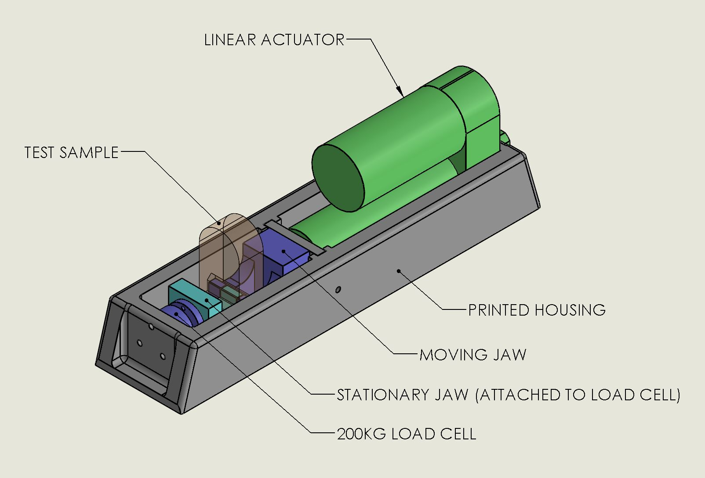
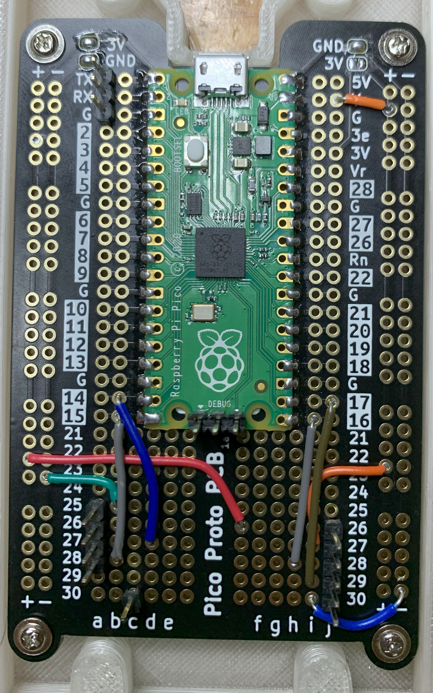
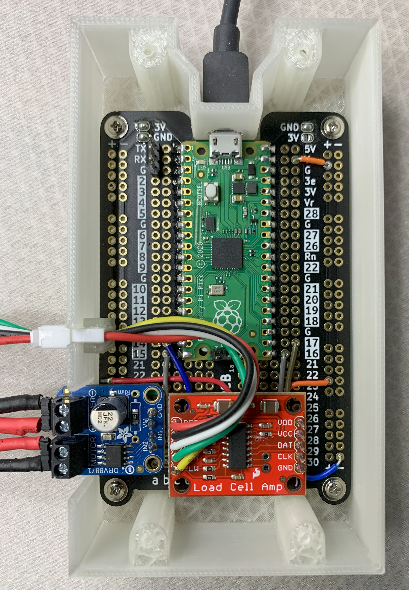

# layer-adhesion-tester
A device to measure layer adhesion in FDM-3D-printed parts. The results from testing printed samples with this device can be use to analyze slicer settings and material properties. 

The device consists of a linear actuator and a load cell.  The load cell data is amplified and digitized by an HX711 breakout board, and the motor in the linear actuator is driven by a MOSFET H-bridge.  A Raspberry Pi Pico micro controller ties it all together and sends data thru a USB serial port for analysis and charting on a computer.

The code is formatted as an Arduino Sketch, and is ready for loading into the Arduino IDE for compiling.  The driver for the HX711 load cell amplifier was written by Daniel Robertson, and a subset of this library (minus the code that supports daisy-chaining multiple load cell amps together on the same bus) is included in the repository for easy compiling.  The full library and documentation can be found here: [hx711-pico-c](https://github.com/endail/hx711-pico-c)
 
#Building the Hardware

##Routing and soldering the wires onto a protoboard

Below is an image showing one way to hook up the load cell amp and the H-bridge motor driver:

##Placement of load cell amp and H-bridge

Here is what the finished circuit looks like all soldered together and ready to go:

