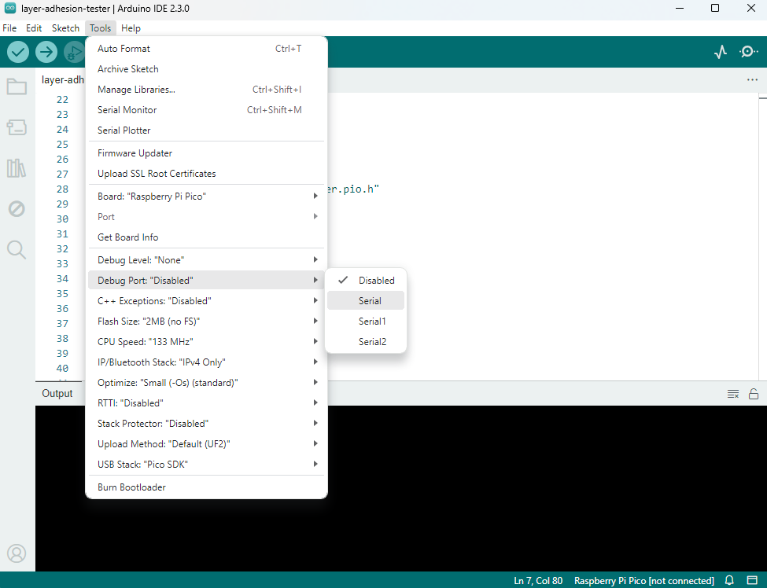

# layer-adhesion-tester
A device to measure layer adhesion in FDM-3D-printed parts. The results from testing printed samples with this device can be use to analyze slicer settings and material properties. 

The device consists of a linear actuator and a load cell.  The load cell data is amplified and digitized by an HX711 breakout board, and the motor in the linear actuator is driven by a MOSFET H-bridge.  A Raspberry Pi Pico micro controller ties it all together and sends data thru a USB serial port for analysis and charting on a computer.

The code is formatted as an Arduino Sketch, and is ready for loading into the Arduino IDE for compiling.  The driver for the HX711 load cell amplifier was written by Daniel Robertson, and a subset of this library (minus the code that supports daisy-chaining multiple load cell amps together on the same bus) is included in the repository for easy compiling.  The full library and documentation can be found here: [hx711-pico-c](https://github.com/endail/hx711-pico-c)
 
# Building the Hardware

## Sourcing the parts

Raspberry Pi Picos can be bought online from several different places.  However, the protoboard used for the project is unique and a bit harder to find.  It's nice because it clearly labels the Pi Pico pins, it has the same layout as a small breadboard, and it allows one to solder the Pi Pico directly to the board without needing to add headers.  (It also has holes if you want to use a Pi Pico H with pre-soldered headers.)

The "Pico Proto PCB" is made by MonkMakes, and at the time of this writing is available in the US from [PiShop.us](https://www.pishop.us/product/pico-proto-pcb/)

The load cell amp is a [breakout board based on the HX711 made by SparkFun](https://www.sparkfun.com/products/13879)

There are many options out there for load cell amps, and many others could be substituted.  It is important, however, that the sampling rate is high enough to get accurate results.  The layer adhesion tester can put a lot of force on the sample before it manages to break it, and the force on the load cell ramps up very quickly just before breakage.  So if the sample rate is too slow, you will get inconsistent results since the sample should ideally be taken just before breakage.  If the sample is taken a bit before breakage, and then after breakage, the time where "peak force" is on the load cell will be missed, and the device will show a lower breaking force than what actually happened.  The SparkFun load cell amp linked above has the option to increase the sampling rate to 80 hz by cutting a jumper on the back of the board labeled "RATE" - it is highly recommended to cut this jumper.  (It's easier to do this before it is soldered down.  Ask us how we know...)

One "gotcha" with this particular breakout board is that you can power the Wheatstone Bridge in your load cell with a different power supply than the on-board interface logic.  You can (arguably) gain an SNR edge by using a higher voltage for the AD conversion and bridge, so we have the bridge hooked up to VSYS on the Pi Pico (about 5 volts) and the logic hooked to 3.3 volts.  (See the photo below to see how this works.) Be careful to not mix this up, since the HX711 will happily run at 5V but the Pi Pico is not 5 volt tolerant and will likely not be as happy...  To be safe you could get away with hooking both VCC and VDD on the load cell amp to 3.3v.  (Will likely work fine, but we have not tested it that way.)

An interesting experiment would be to build this device with [this load cell amp](https://www.sparkfun.com/products/15242), also from SparkFun.  According to the data sheet, this chip can sample at 320 samples per second!  Of course, it can be assumed that a faster sample rate reduces or eliminates some internal oversampling and filtering done on the chip, and therefore will probably yield a noisier signal.  The added noise may negate any advantage that a fast sample rate would give you, so this would take some experimentation to prove out.

The H-bridge can be almost anything, even cooked up from scratch with parts you may already have lying around.  However, we found that the [DRV8871-based breakout from AdaFruit](https://www.adafruit.com/product/3190) fits this project perfectly.  By default, this board is current limited to 2 amps, which is just about perfect for this application.  That's plenty of power to break very strong test samples, yet not so much that you risk burning out the motor or melting wires.  

## Routing and soldering the wires onto a protoboard

Below is an image showing one way to hook up the Pi Pico to the headers for the load cell amp and the motor driver:

## Placement of load cell amp and H-bridge

Here is what the finished circuit looks like all soldered together and ready to go:

## Compiling the code

If you don't have it already, the Arduino IDE can be [downloaded here](https://www.arduino.cc/en/software)

The code in this repo uses an "external" Arduino core for the Raspberry Pi Pico called arduino-pico.  The Arduino IDE comes with a core for the Pi Pico called MBED-OS, but the arduino-pico core has many advantages and is well worth the trouble of installing it. Just follow the [instructions here](https://arduino-pico.readthedocs.io/en/latest/install.html) to set up the Arduino IDE with arduino-pico.

The advantages of arduino-pico core include the addition of printf() functions for debugging and serial output, an EEPROM emulator (for persistent storage to flash) and lower memory usage.  [Here](https://github.com/earlephilhower/arduino-pico/discussions/246) is a more in-depth discussion of the differences in the two cores.

The author of this code is very used to using the C "printf()" function to get output formatted just the way he wants it, all in one line.  Yes, the formatting codes for printf are pretty cryptic, and it can be argued that the "Arduino Way" of using Serial.print() on multiple lines is better for beginners.  However, this code uses printf and Earle Philhower's arduino-pico core library (linked to above) automagically routes stdout (ie. printf) thru the virtual serial port over USB. To enable this feature in the Arduino IDE, go to the "Tools" menu, go to the "Debug Port" sub-menu (about halfway down the list) and select "Serial" (see image below)

